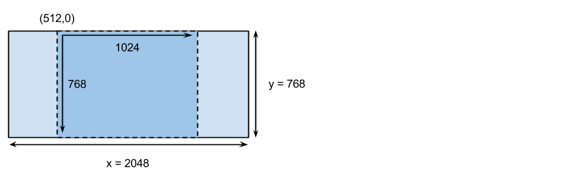

# aspect_ratio

[](https://travis-ci.org/envato/aspect_ratio)

Image aspect ratio utilities.

The Ruby port of [node-aspectratio](https://www.npmjs.com/package/aspectratio) npm module. 

## Install

Install globally

```
gem install aspect_ratio
```

OR

Install locally with Bundler

Please include 

```
gem 'aspect_ratio'
```

in your `Gemfile` then `bundle install`

## Test

```
ruby test/aspect_ratio_test.rb
```

## API

### crop(**integer** `width`, **integer** `height`, **string** `ratio`)

Apply a fixed aspect `ratio` crop without distoring the image aspect ratio.

* **integer** `width` - original image width
* **integer** `height` - original image height
* **string** `ratio` - new image ratio

> The `ratio` must be on the following format: `x`:`y` where `x` and `y` are
> integers. The order of `x` and `z` does not matter and `3:4` will be treated
> as `4:3`.

> By default #crop() will match the orientation of the original image unless a
> forced orientation is given on the follwing format: `x`:`y`!`z` where `z` is
> the orientation (`v` for vertical, or `h` for horizontal).

#### Return

This will return an `Array` of four values:

1. **integer** `x` - top lef x coordinate
2. **integer** `y` - top lef y coordinate
3. **integer** `width` - new image width
4. **integer** `height` - new image height

#### Example

```ruby
require 'aspect_ratio'
AspectRatio.crop(2048, 768, '4:3');
// [512, 768, 1024, 768]
```



### resize(**integer** `x`, **integer** `y`, **integer** `maxX`, **integer** `maxY`)

Get resized height and width of an image while perserving the aspect ratio of
the image.

* **integer** `x` - original image width
* **integer** `y` - original image height
* **integer** `maxX` - max image width
* **integer** `maxY` - max image height

### Return

Returns an `Array` of the resized `x` and `y` values:

* **integer** `x` - resized image width
* **integer** `y` - resized image height

## [MIT License](./LICENSE)
